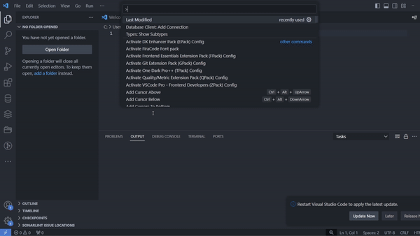

# Rapid Last Modified

Rapid Last Modified is a Visual Studio Code extension that provides users with instant insights into the latest modifications made to their active files. Seamlessly integrated into the status bar, this extension displays timestamps and usernames, facilitating collaboration and version tracking. With robust error handling and cross-platform compatibility, Rapid Last Modified prioritizes user experience, ensuring uninterrupted functionality across Windows and Linux systems.

## Features

- Displays file modification details in the status bar.
- Enhances collaboration and version tracking.
- Cross-platform compatibility.

## Requirements

No additional requirements or dependencies are needed for this extension.

## Extension Settings

This extension does not add any additional VS Code settings.

## Demo

## Known Issues

No known issues at this time.

## Release Notes

### 1.0.0

- Initial release of Rapid Last Modified.

## Following Extension Guidelines

Ensure that you've read through the extensions guidelines and follow the best practices for creating your extension.

- [Extension Guidelines](https://code.visualstudio.com/api/references/extension-guidelines)

## Contact

For any inquiries or feedback, feel free to reach out on [LinkedIn](https://www.linkedin.com/in/ahsensaeed/).

## Working with Markdown

You can author your README using Visual Studio Code. Here are some useful editor keyboard shortcuts:

- Split the editor (`Cmd+\` on macOS or `Ctrl+\` on Windows and Linux).
- Toggle preview (`Shift+Cmd+V` on macOS or `Shift+Ctrl+V` on Windows and Linux).
- Press `Ctrl+Space` (Windows, Linux, macOS) to see a list of Markdown snippets.

## For More Information

## Developer :

Ahsan Saeed
